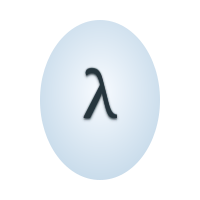

<p align="center">
  
</p>

# Moonstone

[](https://github.com/danilomo/Moonstone/actions)
[](LICENSE)
[](https://kotlinlang.org)

A Scheme-based declarative UI framework built on top of Jetpack Compose Multiplatform. Write native desktop and Android applications using Scheme (Lisp).

## Features

- **Declarative UI in Scheme** - Build UIs using familiar Lisp syntax
- **Reactive State Management** - Simple state cells with automatic UI updates
- **Material Design 3** - Full Material Design 3 component library
- **Cross-Platform** - Desktop (Windows, macOS, Linux) and Android support
- **2D Game Support** - Canvas with game loop, draw primitives, and gamepad input
- **Hot Reload** - See changes instantly without restarting
- **Debug Tools** - Built-in component inspector and debug overlay

## Quick Start

### Prerequisites

- JDK 17 or higher
- Gradle 8.x (included via wrapper)

### Build & Run

```bash
# Clone the repository
git clone https://github.com/danilomo/Moonstone.git
cd Moonstone

# Build the project
./gradlew build

# Run a sample application
./gradlew :desktop:run --args="samples/counter/app.scm"
```

## Example

Here's a simple counter application:

```scheme
(define count (state 0))

(define (increment)
  (state-update! count (lambda (x) (+ x 1))))

(define (app)
  (column
   #:padding 32
   #:spacing 16
   #:horizontal-alignment 'center

   (text #:value "Counter" #:style 'headline-large)

   (text #:value count #:style 'display-large)

   (button #:on-click increment
     (text #:value "Increment"))))
```

Run it with:
```bash
./gradlew :desktop:run --args="samples/counter/app.scm"
```

## Components

Moonstone provides **35 components** covering layouts, inputs, navigation, Material Design 3, and more:

### Layout
- `box`, `column`, `row` - Flexible layouts
- `surface` - Material Design surface
- `spacer` - Add spacing between elements
- `scaffold` - App structure with app bar and navigation

### Display
- `text` - Text display with typography styles
- `icon` - Material Design icons

### Input
- `button` - Buttons with multiple styles
- `text-field`, `outlined-text-field` - Text input
- `checkbox`, `switch`, `radio-button` - Selection controls

### Lists
- `lazy-column`, `lazy-row` - Efficient scrolling lists
- `list-item` - List item wrapper with keys

### Navigation
- `top-app-bar` - Top application bar
- `bottom-navigation`, `nav-item` - Bottom navigation

### Dialogs
- `alert-dialog` - Modal dialogs
- `bottom-sheet` - Bottom sheets
- `snackbar` - Brief notifications

### Material Design Components
- `card` - Material cards (filled, elevated, outlined)
- `chip` - Filter chips, action chips, input chips
- `slider` - Value selection from a range
- `progress-indicator` - Circular and linear progress
- `fab` - Floating action buttons (standard, small, large, extended)
- `badge` - Notification badges with counts
- `divider` - Content separators
- `image` - Image display with shapes
- `dynamic-list` - State-driven list rendering

### Control Flow
- `switch-view`, `view` - Conditional rendering
- `error-boundary` - Error handling

### Game
- `game-canvas` - Fixed-size drawing surface with optional game loop
- `rect`, `circle`, `line` - Draw primitives rendered inside a game-canvas

**📖 Full reference:** See [Component Reference](docs/component-reference.md) for all components with complete props and examples.

## 2D Game Support

Moonstone includes a `game-canvas` component with a built-in game loop and draw primitives (`rect`, `circle`, `line`). Gamepad input works on both Desktop and Android via `on-key-down`.

```scheme
; Bouncing ball — full game in ~25 lines
(define bx 150) (define by 100)
(define vx 3)   (define vy 2)
(define render-tick (state 0))
(define (refresh!) (state-set! render-tick (+ (state-ref render-tick) 1)))

(define (tick!)
  (set! bx (+ bx vx)) (set! by (+ by vy))
  (when (or (< bx 12) (> bx 288)) (set! vx (- vx)))
  (when (or (< by 12) (> by 388)) (set! vy (- vy)))
  (refresh!))

(on-key-down
  (lambda (key)
    (when (string=? key "a") (set! vy (- vy 1)))))

(define (app)
  (game-canvas #:width 300 #:height 400 #:background "#1A1A2E"
    #:on-tick tick! #:tick-interval 16
    (list (circle #:cx bx #:cy by #:radius 12 #:color "#00BCD4"))))
```

Run the Tetris sample:
```bash
./gradlew :desktop:run --args="samples/tetris/app.scm"
```

**📖 Full guide:** See [2D Game Guide](docs/game-guide.md) for the complete game loop pattern, draw primitives reference, and Tetris walkthrough.

## Database Support

Moonstone includes a full-featured SQLite ORM accessible from Scheme:

- **Schema Definition** - Define tables with typed columns, constraints, and foreign keys
- **CRUD Operations** - Insert, query, update, and delete with async callbacks
- **Transactions** - Atomic multi-operation transactions
- **Migrations** - Schema versioning and migrations
- **Cross-Platform** - Identical API on Android and Desktop

```scheme
(db-table products
  (id #:serial)
  (name #:string #:not-null)
  (price #:real))

(define (app)
  (column #:padding 16
    (button #:on-click (lambda ()
      (db-insert products #:values (p-map #:name "Widget" #:price 19.99)
        (lambda (id error)
          (if error
            (println error)
            (println (string-append "ID: " (number->string id)))))))
      (text #:value "Add Product"))))
```

See `samples/database-crud/` for more examples.

## Developer Tools

### Hot Reload

Watch for file changes and automatically reload:

```bash
./gradlew :desktop:run --args="--hot-reload samples/counter/app.scm"
```

### Debug Mode

Enable the debug panel and component inspector:

```bash
./gradlew :desktop:run --args="--debug samples/counter/app.scm"
```

Combine both:

```bash
./gradlew :desktop:run --args="-d -w samples/counter/app.scm"
```

## Code Quality

Moonstone uses **Detekt** and **ktlint** for static analysis and code formatting:

```bash
# Run all linting checks
./gradlew lintAll

# Auto-format all Kotlin code
./gradlew formatAll

# Run individual checks
./gradlew ktlintCheck    # Code style and formatting
./gradlew detekt         # Static analysis
```

Linting is automatically enforced in CI/CD. The project follows Kotlin official code style with strict rules for:
- No wildcard imports
- 120 character line length
- Consistent formatting and import ordering
- Complexity and code smell detection

## Documentation

### 📚 Documentation Map

| Document | Description | Start Here If... |
|----------|-------------|------------------|
| **[Getting Started Guide](docs/getting-started.md)** | Tutorial walkthrough covering basics, state management, components, and building your first app | You're new to Moonstone |
| **[Component Reference](docs/component-reference.md)** | Complete reference for all components with props, examples, and patterns | You're building UI |
| **[API Reference](docs/api-reference.md)** | Core APIs: state management, `derived`, platform functions, input events | You need state, platform APIs, or input handling |
| **[2D Game Guide](docs/game-guide.md)** | Game loop, draw primitives, input, state patterns, and a Tetris walkthrough | You're building a game |
| **[ORM Reference](docs/orm-reference.md)** | Complete database API: tables, queries, CRUD, transactions, migrations | You're using the database |
| **[ORM Guide](docs/orm-guide.md)** | Step-by-step database tutorial with best practices | You're learning the ORM |

### Quick Links

- **Samples:** `samples/` directory contains working examples (counter, todo, navigation, dialogs, database-crud, tetris, gamepad-test)
- **Run a sample:** `./gradlew :desktop:run --args="samples/counter/app.scm"`
- **Hot reload:** Add `--hot-reload` flag to watch for changes
- **Debug mode:** Add `--debug` flag for component inspector

## Building Native Packages

### Desktop Installers

```bash
# Linux
./gradlew :desktop:packageDeb    # Debian/Ubuntu installer
./gradlew :desktop:packageRpm    # Fedora/RHEL installer

# macOS (requires macOS)
./gradlew :desktop:packageDmg    # macOS disk image

# Windows (requires Windows)
./gradlew :desktop:packageMsi    # Windows installer
```

### Windows Portable Distribution

Create a portable Windows distribution (no installation required):

```bash
./gradlew :desktop:packageWindowsPortable
```

Output: `build/compose/binaries/main/portable/moonstone-1.0.0-windows-portable.zip`

**Features:**
- No installation required - just extract and run
- Includes bundled JRE - no Java installation needed
- Self-contained - works on any Windows machine
- Perfect for USB drives or restricted environments

**Usage:**
1. Extract the ZIP anywhere
2. Run `moonstone\bin\moonstone.bat`

## Project Structure

```
Moonstone/
├── core/                 # Core framework (shared code)
│   └── src/commonMain/
│       └── kotlin/net/kleinlisp/gui/
│           ├── components/   # UI component implementations
│           ├── debug/        # Debug tools (hot reload, inspector)
│           ├── error/        # Error handling infrastructure
│           ├── render/       # Compose rendering
│           └── runtime/      # Scheme runtime integration
├── desktop/              # Desktop application entry point
├── samples/              # Example applications
│   ├── hello-world/
│   ├── counter/
│   ├── greeting/
│   ├── layouts/
│   ├── interactive/
│   ├── lists/
│   ├── navigation/
│   ├── dialogs/
│   ├── todo/
│   ├── form-validation/
│   ├── database-crud/
│   ├── database-transaction/
│   ├── database-migration/
│   ├── database-benchmark/
│   ├── gamepad-test/         # Interactive gamepad button tester
│   └── tetris/               # Fully playable Tetris with joystick
└── docs/                 # Documentation
```

## License

This project is licensed under the MIT License - see the [LICENSE](LICENSE) file for details.

## Contributing

Contributions are welcome! Please read our [Contributing Guidelines](CONTRIBUTING.md) before submitting pull requests.
